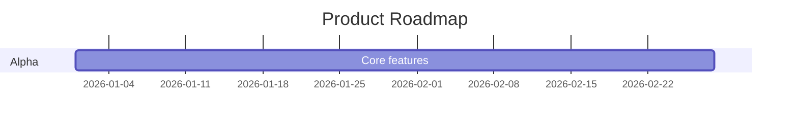

# Claude Docs — Full SDLC Documentation Toolchain

Covers the complete software development lifecycle: **Pre → During → Post**.
All outputs use the numbered folder structure compatible with `/docs` Claude Code slash command.

## Command Reference

| Command | Phase | Description |
|---|---|---|
| `/docs` | Any | Auto-detect project type, scaffold full structure |
| `/docs scaffold <type> [--phase]` | Any | Scaffold by project type + SDLC phase |
| `/docs spec` | Pre | Interview → generate Product Specification |
| `/docs roadmap` | Pre | Generate versioned roadmap (all formats) |
| `/docs reorganize` | Any | Reorganize existing docs into numbered standard |
| `/docs validate` | Any | Validate against standards, report issues |
| `/docs update-toc` | Any | Refresh all README.md table of contents |
| `/docs health` | Any | SDLC coverage + quality health report |
| `/docs support` | Post | Scaffold support cluster (FAQ, triage, SLA, etc.) |
| `/docs runbook` | Post | Generate ops/deployment runbook with checklists |
| `/docs release-note [--tldr]` | Post | Release notes from git log |

---

## SDLC Folder Structure

```
docs/
├── README.md                         ← Master index
├── 00-product/                       ← Pre: spec, PRD, roadmap
│   ├── README.md
│   ├── 01-product-spec.md
│   ├── 02-requirements.md
│   └── 03-roadmap.md
├── 01-architecture/                  ← Pre/During: design, ADRs
│   ├── README.md
│   ├── 01-overview.md
│   ├── 02-patterns.md
│   ├── 03-data-layer.md
│   └── adr/
│       └── 0001-record-architecture-decisions.md
├── 02-development/                   ← During: setup, workflows, testing
│   ├── README.md
│   ├── 01-getting-started.md
│   ├── 02-workflows.md
│   └── 03-testing.md
├── 03-deployment/                    ← Post: deploy, ops runbook
│   ├── README.md
│   ├── 01-overview.md
│   └── 02-runbook.md
├── 04-api/                           ← During/Post: contracts
│   ├── README.md
│   └── 01-endpoints.md
└── 05-support/                       ← Post: FAQ, triage, SLA, post-mortem
    ├── README.md
    ├── 01-faq.md
    ├── 02-support-workflow.md
    ├── 03-sla.md
    ├── 04-post-mortem-template.md
    └── 05-deprecation.md
```

### Phase Filtering for Scaffold

| Flag | Folders Generated |
|---|---|
| `--phase pre` | `00-product/`, `01-architecture/` |
| `--phase during` | `02-development/`, `04-api/` |
| `--phase post` | `03-deployment/`, `05-support/` |
| `--phase all` (default) | All folders |

---

## 1. Scaffold New Documentation

### Step 1: Auto-Detect Project Type

| Signal | Project Type |
|---|---|
| `composer.json` + Laravel deps, `artisan` | `laravel` |
| OpenAPI/Swagger, REST/GraphQL description | `api` |
| `bin/` directory, CLI flags/commands | `cli` |
| "package", "library", "SDK", "client library" | `sdk` |
| Frontend + backend together | `fullstack` |
| `pyproject.toml`, `requirements.txt` | `python` |
| `Cargo.toml` | `rust` |
| `go.mod` | `go` |
| `Gemfile` | `ruby` |
| `*.csproj`, `*.sln` | `dotnet` |
| `pom.xml`, `build.gradle` | `java` |
| `pubspec.yaml` | `dart` |
| `mix.exs` | `elixir` |

If ambiguous, ask: "What type of project is this?"

### Step 2: Read Reference Files

- `references/scaffolds.md` — file contents per project type (during-phase dev docs)
- `references/sdlc-templates.md` — pre and post phase document templates

### Step 3: Generate Files

Apply [Linting Rules](#linting-rules) to every file. Present grouped by phase.
Always include root `README.md` with mandatory badges — see `references/badges.md`.

---

## 2. `/docs spec` — Product Specification (Interview Mode)

### Interview Phase

Ask questions in **three blocks**, one at a time:

**Block 1 — Core Identity**
- What is the product/feature name?
- What problem does it solve? (one sentence)
- Who is the target user? (be specific)

**Block 2 — Scope**
- What are the 3–5 key features in scope for this version?
- What is explicitly out of scope?
- What are the hard constraints? (tech stack, deadline, budget, compliance)

**Block 3 — Success**
- How will you know it's working? (metrics, KPIs)
- What does the minimum viable version look like?
- Are there any existing systems this must integrate with?

After Block 3, confirm: "Here's what I've captured — shall I generate the spec?"

### Generate

Read `references/sdlc-templates.md` → **Product Specification** section.
Populate every field from interview answers.
Mark genuinely unknown fields as `> ⚠️ TBD — needs decision` rather than leaving blank.

Output: `docs/00-product/01-product-spec.md`

---

## 3. `/docs roadmap` — Versioned Roadmap

Ask the user for: version targets, milestone names, dates or quarters, features per version.
If no dates given, use "Q1 2026", "Q2 2026" etc.

Generate all four formats in `docs/00-product/03-roadmap.md`.
Read `references/sdlc-templates.md` → **Roadmap** section for the full template.

**Format 1 — Markdown Version Table**

| Version | Milestone | Target | Status | Key Features |
|---|---|---|---|---|
| v0.1 | Alpha | Q1 2026 | 🔵 Planned | ... |

**Format 2 — Mermaid Gantt**



**Format 3 — GitHub Milestones JSON**

Fenced block the user can paste into a GitHub Milestones import script:

```json
[{ "title": "v0.1 Alpha", "description": "...", "due_on": "2026-02-28T00:00:00Z" }]
```

**Format 4 — Phase Summary**

```
Alpha (v0.1)  → Core features, internal testing
Beta (v0.2)   → External testing, feedback loop
GA (v1.0)     → Production-ready, full docs, SLA active
```

---

## 4. Reorganize, Validate, Update TOC

### Reorganize

Map current files → numbered SDLC structure. Show mapping first, get confirmation, then generate.

### Validate

| Check | Pass Condition |
|---|---|
| Numbered folders | All `docs/` subdirs prefixed `00-` through `05-` |
| README in each folder | Every `docs/*/` has a `README.md` |
| Main TOC | `docs/README.md` links all sections |
| Single H1 | Each `.md` has exactly one `#` heading |
| ATX headers | `#` style, not underline |
| Fenced code blocks | Triple backticks + language identifier |
| Line length | Prose ≤ 120 chars |
| Badges | Root `README.md` has version + license badges |
| SDLC coverage | `00-product/`, `02-development/`, `05-support/` exist |

### Update TOC

Scan each folder's `.md` files in numbered order. Replace between `<!-- TOC -->` /
`<!-- /TOC -->` markers, or insert after first `##` heading.

---

## 5. `/docs health` — Health Report

### Quality Score (60 pts)

| Metric | Max |
|---|---|
| Folder structure + README per folder | 15 |
| Badge compliance | 10 |
| Code block quality (language identifiers) | 10 |
| TOC completeness | 10 |
| Line length compliance | 10 |
| Single H1 per file | 5 |

### SDLC Coverage Score (40 pts)

| Phase | Folder | Max |
|---|---|---|
| Pre-Dev: Product | `00-product/` with spec + roadmap | 15 |
| During: Development | `02-development/` with getting-started + testing | 10 |
| Post: Support | `05-support/` with FAQ + workflow | 15 |

### Output Format

```
Documentation Health Report — [Project Name]
============================================
Generated: [date]  |  Project Type: [type]

📊 Overall Score: 72/100

Quality (48/60)
  Folder Structure    ████████████░░   12/15
  Badge Compliance    ███████░░░        7/10
  Code Blocks         ██████████       10/10
  TOC                 ████████░░        8/10
  Line Length         █████████░        9/10
  Single H1           █████             5/5

SDLC Coverage (24/40)
  Pre-Dev / Product   ████████░░░░░░░   8/15  ← missing roadmap
  During / Dev        ██████████       10/10
  Post / Support      ██████░░░░░░░░░   6/15  ← missing SLA + post-mortem

Issues Found:
  ❌ [HIGH]  05-support/ missing — run /docs support
  ⚠️  [MED]   00-product/03-roadmap.md missing — run /docs roadmap
  ⚠️  [MED]   No license badge in root README.md
  ℹ️  [LOW]   4 files exceed 120-char line limit

Recommendations:
  1. /docs support    → scaffold full support cluster
  2. /docs roadmap    → generate versioned roadmap
  3. Add badge: [](LICENSE)
```

---

## 6. `/docs support` — Support Cluster

Generates five files under `docs/05-support/`.
Read `references/sdlc-templates.md` → **Support** section for each template.
Ask for project name and context before generating.

| File | Content |
|---|---|
| `01-faq.md` | Common questions, troubleshooting, known limitations |
| `02-support-workflow.md` | Issue triage flow, response process, escalation path |
| `03-sla.md` | Severity levels, response times, resolution targets |
| `04-post-mortem-template.md` | Incident timeline, root cause, action items |
| `05-deprecation.md` | EOL announcement, migration guide, timeline |

---

## 7. `/docs runbook` — Ops Runbook

Ask: project type, hosting environment, deployment method (manual / CI-CD / Docker / k8s).
Read `references/sdlc-templates.md` → **Runbook** section.
Output: `docs/03-deployment/02-runbook.md`

Sections generated: pre-deploy checklist, deploy steps (numbered, atomic),
post-deploy verification, rollback procedure, emergency contacts.

---

## 8. Release Notes

User provides git log output (`git log --oneline --since="X"`).

| Prefix | Section |
|---|---|
| `feat:` / `feature:` | ✨ New Features |
| `fix:` / `bugfix:` | 🐛 Bug Fixes |
| `docs:` | 📚 Documentation |
| `refactor:` | ♻️ Refactoring |
| `perf:` | ⚡ Performance |
| `test:` | 🧪 Tests |
| `chore:` / `build:` / `ci:` | 🔧 Maintenance |
| `BREAKING CHANGE` | 💥 Breaking Changes |

Full: version header, summary table, categorised commits, contributor list.
`--tldr`: version, date, one-line per section, total count.

---

## Linting Rules

| Rule | Requirement |
|---|---|
| Headers | ATX style (`#` not underline) |
| Lists | Dash (`-` not `*` or `+`) |
| List indent | 2 spaces |
| Line length | Prose ≤ 120 chars; code exempt |
| H1 per file | Exactly one |
| Code blocks | Fenced, triple backtick + language identifier |
| Spacing | Blank line before/after headings and code blocks |

---

## Badge Standards

Mandatory on every root `README.md`:

```markdown
[](...)
[](LICENSE)
```

Full templates and project type badge matrix → `references/badges.md`.

---

## Reference Files

| File | Read When |
|---|---|
| `references/scaffolds.md` | Generating during-phase dev docs per project type |
| `references/sdlc-templates.md` | Pre-dev (spec, roadmap) or post-dev (support, runbook) |
| `references/badges.md` | Adding badges to any README |
