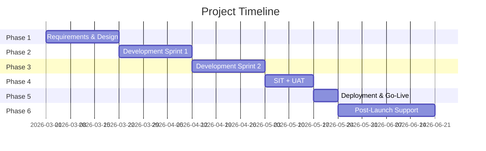

# Project Proposal Template

Full project proposal template for client-facing documents. Includes both English and
Bahasa Malaysia versions. Read this file when generating a proposal via `/req proposal`.

---

## English Version — Project Proposal

```markdown
# Project Proposal: [Project Name]

**Prepared for:** [Client Name], [Organisation]
**Prepared by:** [Your Name / Company]
**Date:** [YYYY-MM-DD]
**Proposal Ref:** PROP-[YYYY]-[NNN]
**Valid Until:** [Date + 30 days]
**Confidentiality:** This document is confidential and intended only for the named recipient.

---

## 1. Executive Summary

[2–3 paragraphs summarising the opportunity, proposed solution, and expected outcomes.
This is the most important section — many decision-makers only read this.]

> [Client Organisation] requires [brief problem statement]. We propose [solution summary]
> that will [key benefit 1], [key benefit 2], and [key benefit 3]. The project will be
> delivered over [duration] at a total investment of [currency] [amount].

---

## 2. Project Overview

### 2.1 Background

[Describe the client's current situation, pain points, and why this project is needed.
Show that you understand their business.]

### 2.2 Objectives

| # | Objective                                         | Success Metric            |
|---|---------------------------------------------------|---------------------------|
| 1 | [Primary objective]                               | [How you'll measure it]   |
| 2 | [Secondary objective]                             | [How you'll measure it]   |
| 3 | [Tertiary objective]                              | [How you'll measure it]   |

### 2.3 Proposed Solution

[Describe the solution at a high level — what will be built, what technology will be used,
how it addresses the objectives above. Include a simple architecture diagram if relevant.]

---

## 3. Scope of Work

### 3.1 In Scope

| # | Deliverable                    | Description                              |
|---|--------------------------------|------------------------------------------|
| 1 | Requirements Analysis          | Stakeholder interviews, SRS document     |
| 2 | System Design                  | Architecture, database design, UI/UX     |
| 3 | Development                    | Core system development and unit testing |
| 4 | Testing                        | SIT, UAT support, bug fixes              |
| 5 | Deployment                     | Production deployment and go-live support|
| 6 | Documentation                  | User manual, admin guide, API docs       |
| 7 | Training                       | [N] days of user training                |
| 8 | Post-Launch Support            | [N] months warranty support              |

### 3.2 Out of Scope

- [Explicitly list what is NOT included]
- [Hardware procurement]
- [Third-party license costs]
- [Data migration from legacy system (unless specified)]
- [Ongoing hosting costs after warranty period]

### 3.3 Assumptions

- Client will provide timely access to stakeholders for interviews and UAT
- Client will provide test data within [N] weeks of project commencement
- Existing system documentation is available and accurate
- Client IT team will handle DNS, SSL certificates, and server provisioning

---

## 4. Timeline and Milestones

### 4.1 Project Timeline

| Phase | Description                  | Duration  | Start        | End          |
|-------|------------------------------|-----------|--------------|--------------|
| 1     | Requirements & Design        | 3 weeks   | Week 1       | Week 3       |
| 2     | Development — Sprint 1       | 3 weeks   | Week 4       | Week 6       |
| 3     | Development — Sprint 2       | 3 weeks   | Week 7       | Week 9       |
| 4     | Testing (SIT + UAT)          | 2 weeks   | Week 10      | Week 11      |
| 5     | Deployment & Go-Live         | 1 week    | Week 12      | Week 12      |
| 6     | Post-Launch Support          | 4 weeks   | Week 13      | Week 16      |

**Total Duration:** [N] weeks / [N] months

### 4.2 Milestones and Payments

| Milestone | Description              | Due         | Payment     |
|-----------|--------------------------|-------------|-------------|
| M1        | Project Kick-off         | Week 1      | 30%         |
| M2        | Design Sign-off          | Week 3      | —           |
| M3        | Development Complete     | Week 9      | 40%         |
| M4        | UAT Sign-off             | Week 11     | —           |
| M5        | Go-Live                  | Week 12     | 20%         |
| M6        | Warranty Complete        | Week 16     | 10%         |

### 4.3 Gantt Chart (Mermaid)



---

## 5. Deliverables

| # | Deliverable                        | Format     | Delivery Phase |
|---|------------------------------------|------------|----------------|
| 1 | Software Requirements Specification| PDF / MD   | Phase 1        |
| 2 | System Architecture Document       | PDF / MD   | Phase 1        |
| 3 | UI/UX Wireframes                   | Figma / PDF| Phase 1        |
| 4 | Source Code                        | Git Repo   | Phase 3        |
| 5 | Test Report (SIT)                  | PDF / MD   | Phase 4        |
| 6 | UAT Sign-off Document              | PDF        | Phase 4        |
| 7 | User Manual                        | PDF / Web  | Phase 5        |
| 8 | Administrator Guide                | PDF / MD   | Phase 5        |
| 9 | Deployment Runbook                 | MD         | Phase 5        |
| 10| Training Materials                 | Slides+PDF | Phase 5        |
| 11| Source Code Handover               | Git + Docs | Phase 6        |

---

## 6. Pricing and Payment Terms

### 6.1 Pricing Breakdown

| # | Item                               | Amount (RM)   |
|---|------------------------------------|---------------|
| 1 | Requirements Analysis & Design     | XX,XXX        |
| 2 | System Development                 | XX,XXX        |
| 3 | Testing & QA                       | XX,XXX        |
| 4 | Deployment & Go-Live               | XX,XXX        |
| 5 | Documentation & Training           | XX,XXX        |
| 6 | Post-Launch Support ([N] months)   | XX,XXX        |
|   | **Subtotal**                       | **XX,XXX**    |
|   | SST (8%)                           | X,XXX         |
|   | **Total**                          | **XX,XXX**    |

### 6.2 Payment Schedule

| Payment | Milestone               | Percentage | Amount (RM) |
|---------|-------------------------|------------|-------------|
| 1       | Project Kick-off        | 30%        | XX,XXX      |
| 2       | Development Complete    | 40%        | XX,XXX      |
| 3       | Go-Live                 | 20%        | XX,XXX      |
| 4       | Warranty Complete       | 10%        | XX,XXX      |
|         | **Total**               | **100%**   | **XX,XXX**  |

### 6.3 Optional Add-ons

| # | Item                               | Amount (RM)   |
|---|------------------------------------|---------------|
| 1 | Annual Maintenance & Support       | XX,XXX / year |
| 2 | Additional Training (per day)      | X,XXX         |
| 3 | Custom Report Development (each)   | X,XXX         |
| 4 | Mobile App (iOS + Android)         | XX,XXX        |

---

## 7. Project Team

| Role                  | Responsibility                                  | Allocation |
|-----------------------|-------------------------------------------------|------------|
| Project Manager       | Overall delivery, client communication          | 50%        |
| Lead Developer        | Architecture, code review, technical decisions  | 100%       |
| Full-Stack Developer  | Feature development, testing                    | 100%       |
| UI/UX Designer        | Wireframes, UI design, user testing             | 50%        |
| QA Engineer           | Test planning, execution, automation            | 50%        |

---

## 8. Terms and Conditions

### 8.1 Intellectual Property

- All source code and deliverables become the property of [Client] upon full payment
- Third-party libraries and frameworks remain under their respective licences
- [Vendor] retains the right to use general knowledge and techniques gained during the project

### 8.2 Confidentiality

Both parties agree to maintain confidentiality of proprietary information shared during
the project for a period of [2] years following project completion.

### 8.3 Change Management

- Changes to scope will be documented via a Change Request (CR) form
- Each CR will include impact assessment on timeline and cost
- CRs must be approved by both parties before implementation
- Minor UI adjustments during UAT are not considered change requests

### 8.4 Warranty

- [N] months warranty from the date of go-live
- Covers defects in deliverables against agreed requirements
- Does not cover issues caused by client modifications, infrastructure changes, or
  third-party service outages
- Response time: Critical (4 hours), Major (8 hours), Minor (2 business days)

### 8.5 Termination

- Either party may terminate with [30] days written notice
- Payment for completed work and phases is due upon termination
- All deliverables completed to date will be handed over

### 8.6 Limitation of Liability

Total liability shall not exceed the total contract value. Neither party is liable for
indirect, consequential, or incidental damages.

---

## 9. Acceptance

This proposal is valid until [date + 30 days].

| | Client | Vendor |
|---|---|---|
| **Name** | _________________________ | _________________________ |
| **Title** | _________________________ | _________________________ |
| **Date** | _________________________ | _________________________ |
| **Signature** | _________________________ | _________________________ |
```

---

## Bahasa Malaysia Version — Cadangan Projek

```markdown
# Cadangan Projek: [Nama Projek]

**Disediakan untuk:** [Nama Klien], [Organisasi]
**Disediakan oleh:** [Nama Anda / Syarikat]
**Tarikh:** [YYYY-MM-DD]
**Rujukan:** PROP-[YYYY]-[NNN]
**Sah Sehingga:** [Tarikh + 30 hari]
**Kerahsiaan:** Dokumen ini adalah sulit dan hanya untuk penerima yang dinamakan.

---

## 1. Ringkasan Eksekutif

[2–3 perenggan meringkaskan peluang, penyelesaian yang dicadangkan, dan hasil yang
dijangkakan. Ini adalah bahagian paling penting — ramai pembuat keputusan hanya
membaca bahagian ini.]

> [Organisasi Klien] memerlukan [pernyataan masalah ringkas]. Kami mencadangkan
> [ringkasan penyelesaian] yang akan [manfaat utama 1], [manfaat utama 2], dan
> [manfaat utama 3]. Projek ini akan dilaksanakan dalam tempoh [tempoh] dengan
> jumlah pelaburan sebanyak RM [jumlah].

---

## 2. Gambaran Keseluruhan Projek

### 2.1 Latar Belakang

[Huraikan situasi semasa klien, masalah yang dihadapi, dan mengapa projek ini diperlukan.
Tunjukkan bahawa anda memahami perniagaan mereka.]

### 2.2 Objektif

| # | Objektif                                          | Metrik Kejayaan           |
|---|---------------------------------------------------|---------------------------|
| 1 | [Objektif utama]                                  | [Cara pengukuran]         |
| 2 | [Objektif sekunder]                               | [Cara pengukuran]         |
| 3 | [Objektif tambahan]                               | [Cara pengukuran]         |

### 2.3 Penyelesaian yang Dicadangkan

[Huraikan penyelesaian secara umum — apa yang akan dibina, teknologi yang digunakan,
bagaimana ia menangani objektif di atas.]

---

## 3. Skop Kerja

### 3.1 Dalam Skop

| # | Penyerahan                         | Huraian                                 |
|---|------------------------------------|-----------------------------------------|
| 1 | Analisis Keperluan                 | Temubual pemegang taruh, dokumen SRS    |
| 2 | Reka Bentuk Sistem                 | Seni bina, reka bentuk pangkalan data, UI/UX |
| 3 | Pembangunan                        | Pembangunan sistem teras dan ujian unit |
| 4 | Pengujian                          | SIT, sokongan UAT, pembaikan pepijat    |
| 5 | Pelancaran                         | Pelancaran ke produksi dan sokongan     |
| 6 | Dokumentasi                        | Manual pengguna, panduan admin, docs API|
| 7 | Latihan                            | [N] hari latihan pengguna               |
| 8 | Sokongan Pasca Pelancaran          | [N] bulan sokongan waranti              |

### 3.2 Di Luar Skop

- [Senarai secara eksplisit apa yang TIDAK termasuk]
- Perolehan perkakasan
- Kos lesen pihak ketiga
- Migrasi data dari sistem lama (kecuali dinyatakan)
- Kos hosting berterusan selepas tempoh waranti

### 3.3 Andaian

- Klien akan menyediakan akses kepada pemegang taruh untuk temubual dan UAT
- Klien akan menyediakan data ujian dalam tempoh [N] minggu dari permulaan projek
- Dokumentasi sistem sedia ada adalah tepat dan terkini
- Pasukan IT klien akan menguruskan DNS, sijil SSL, dan penyediaan pelayan

---

## 4. Jadual Pelaksanaan dan Pencapaian

### 4.1 Jadual Projek

| Fasa | Huraian                        | Tempoh    | Mula         | Tamat        |
|------|--------------------------------|-----------|--------------|--------------|
| 1    | Keperluan & Reka Bentuk        | 3 minggu  | Minggu 1     | Minggu 3     |
| 2    | Pembangunan — Sprint 1         | 3 minggu  | Minggu 4     | Minggu 6     |
| 3    | Pembangunan — Sprint 2         | 3 minggu  | Minggu 7     | Minggu 9     |
| 4    | Pengujian (SIT + UAT)          | 2 minggu  | Minggu 10    | Minggu 11    |
| 5    | Pelancaran & Go-Live           | 1 minggu  | Minggu 12    | Minggu 12    |
| 6    | Sokongan Pasca Pelancaran      | 4 minggu  | Minggu 13    | Minggu 16    |

**Jumlah Tempoh:** [N] minggu / [N] bulan

### 4.2 Pencapaian dan Pembayaran

| Pencapaian | Huraian                  | Tarikh      | Bayaran     |
|------------|--------------------------|-------------|-------------|
| M1         | Permulaan Projek         | Minggu 1    | 30%         |
| M2         | Kelulusan Reka Bentuk    | Minggu 3    | —           |
| M3         | Pembangunan Selesai      | Minggu 9    | 40%         |
| M4         | Kelulusan UAT            | Minggu 11   | —           |
| M5         | Go-Live                  | Minggu 12   | 20%         |
| M6         | Waranti Selesai          | Minggu 16   | 10%         |

---

## 5. Senarai Penyerahan

| # | Penyerahan                         | Format     | Fasa Penyerahan |
|---|------------------------------------|------------|-----------------|
| 1 | Spesifikasi Keperluan Perisian     | PDF / MD   | Fasa 1          |
| 2 | Dokumen Seni Bina Sistem           | PDF / MD   | Fasa 1          |
| 3 | Wireframe UI/UX                    | Figma / PDF| Fasa 1          |
| 4 | Kod Sumber                         | Git Repo   | Fasa 3          |
| 5 | Laporan Ujian (SIT)                | PDF / MD   | Fasa 4          |
| 6 | Dokumen Kelulusan UAT              | PDF        | Fasa 4          |
| 7 | Manual Pengguna                    | PDF / Web  | Fasa 5          |
| 8 | Panduan Pentadbir                  | PDF / MD   | Fasa 5          |
| 9 | Runbook Pelancaran                 | MD         | Fasa 5          |
| 10| Bahan Latihan                      | Slaid+PDF  | Fasa 5          |

---

## 6. Kos Projek dan Terma Pembayaran

### 6.1 Pecahan Kos

| # | Item                               | Jumlah (RM)   |
|---|------------------------------------|---------------|
| 1 | Analisis Keperluan & Reka Bentuk   | XX,XXX        |
| 2 | Pembangunan Sistem                 | XX,XXX        |
| 3 | Pengujian & QA                     | XX,XXX        |
| 4 | Pelancaran & Go-Live               | XX,XXX        |
| 5 | Dokumentasi & Latihan              | XX,XXX        |
| 6 | Sokongan Pasca Pelancaran ([N] bulan) | XX,XXX     |
|   | **Jumlah Kecil**                   | **XX,XXX**    |
|   | SST (8%)                           | X,XXX         |
|   | **Jumlah Keseluruhan**             | **XX,XXX**    |

### 6.2 Jadual Pembayaran

| Bayaran | Pencapaian              | Peratusan  | Jumlah (RM) |
|---------|-------------------------|------------|-------------|
| 1       | Permulaan Projek        | 30%        | XX,XXX      |
| 2       | Pembangunan Selesai     | 40%        | XX,XXX      |
| 3       | Go-Live                 | 20%        | XX,XXX      |
| 4       | Waranti Selesai         | 10%        | XX,XXX      |
|         | **Jumlah**              | **100%**   | **XX,XXX**  |

---

## 7. Pasukan Projek

| Peranan                | Tanggungjawab                                  | Peruntukan |
|------------------------|------------------------------------------------|------------|
| Pengurus Projek        | Penyerahan keseluruhan, komunikasi klien       | 50%        |
| Pembangun Utama        | Seni bina, semakan kod, keputusan teknikal     | 100%       |
| Pembangun Full-Stack   | Pembangunan ciri, pengujian                    | 100%       |
| Pereka UI/UX           | Wireframe, reka bentuk UI, ujian pengguna      | 50%        |
| Jurutera QA            | Perancangan ujian, pelaksanaan, automasi       | 50%        |

---

## 8. Terma dan Syarat

### 8.1 Harta Intelek

- Semua kod sumber dan penyerahan menjadi hak milik [Klien] setelah pembayaran penuh
- Pustaka dan rangka kerja pihak ketiga kekal di bawah lesen masing-masing
- [Vendor] mengekalkan hak untuk menggunakan pengetahuan dan teknik am yang diperoleh

### 8.2 Kerahsiaan

Kedua-dua pihak bersetuju untuk mengekalkan kerahsiaan maklumat proprietari yang dikongsi
semasa projek untuk tempoh [2] tahun selepas projek selesai.

### 8.3 Pengurusan Perubahan

- Perubahan kepada skop akan didokumenkan melalui borang Permintaan Perubahan (CR)
- Setiap CR akan menyertakan penilaian impak terhadap jadual dan kos
- CR mesti diluluskan oleh kedua-dua pihak sebelum pelaksanaan
- Pelarasan UI kecil semasa UAT tidak dianggap sebagai permintaan perubahan

### 8.4 Waranti

- [N] bulan waranti dari tarikh go-live
- Meliputi kecacatan dalam penyerahan berbanding keperluan yang dipersetujui
- Tidak meliputi isu yang disebabkan oleh pengubahsuaian klien, perubahan infrastruktur,
  atau gangguan perkhidmatan pihak ketiga
- Masa respons: Kritikal (4 jam), Utama (8 jam), Kecil (2 hari perniagaan)

### 8.5 Penamatan

- Mana-mana pihak boleh menamatkan dengan notis bertulis [30] hari
- Bayaran untuk kerja yang telah siap perlu dibuat semasa penamatan
- Semua penyerahan yang telah siap akan diserahkan

---

## 9. Penerimaan

Cadangan ini sah sehingga [tarikh + 30 hari].

| | Klien | Vendor |
|---|---|---|
| **Nama** | _________________________ | _________________________ |
| **Jawatan** | _________________________ | _________________________ |
| **Tarikh** | _________________________ | _________________________ |
| **Tandatangan** | _________________________ | _________________________ |
```

---

## Usage Notes

- For government proposals: always use the BM version as the primary, with EN as supplementary
- For private sector: ask the client which language they prefer
- For bilingual: generate both versions in a single document with dividers, or as two files
- Pull pricing data from `product-config.md` (sales-planner skill) if available
- Payment terms 30/40/20/10 is a common Malaysian pattern — adjust per client relationship
- SST rate is currently 8% — verify before generating as this may change
- Government projects may have specific payment structures (e.g., progress claims) — ask
- Always include out-of-scope section — this prevents scope creep disputes
