# Mermaid.js Diagram Patterns

Quick-reference patterns for each diagram type used in research documents. Copy and adapt.

---

## 1. System Context Diagram

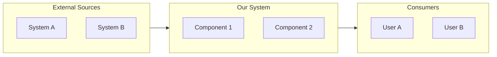

---

## 2. Component Architecture (Top-Down)

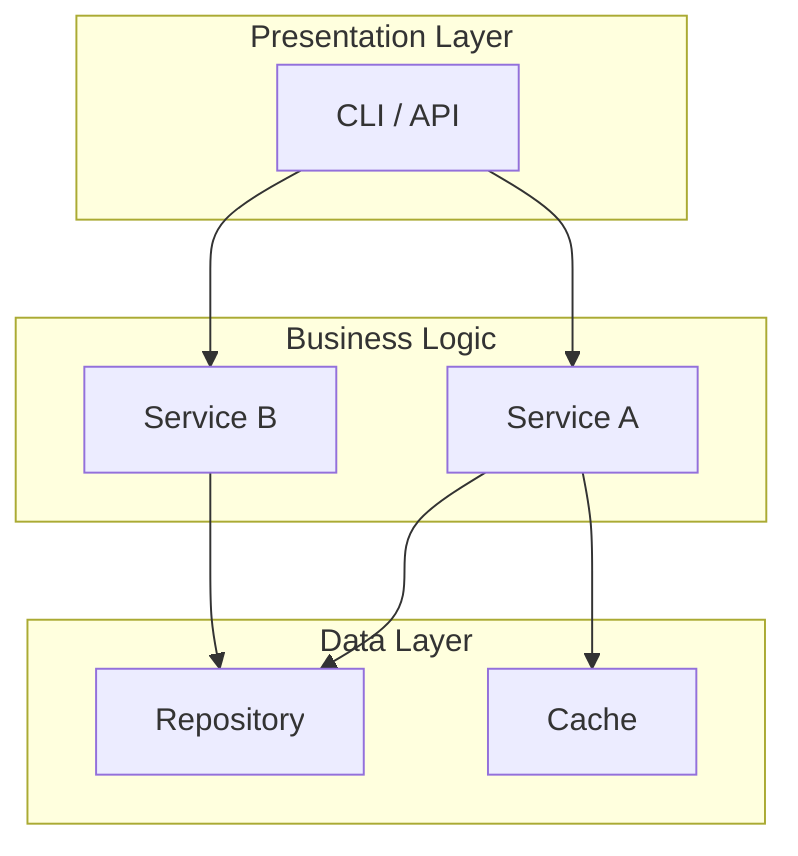

---

## 3. Detailed Flowchart with Decisions

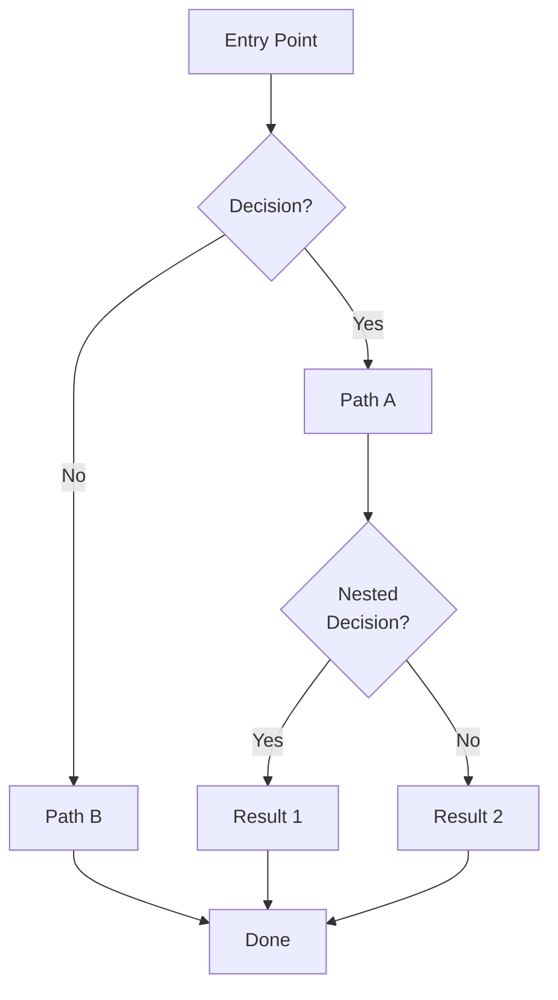

---

## 4. Sequence Diagram (Multi-Actor)

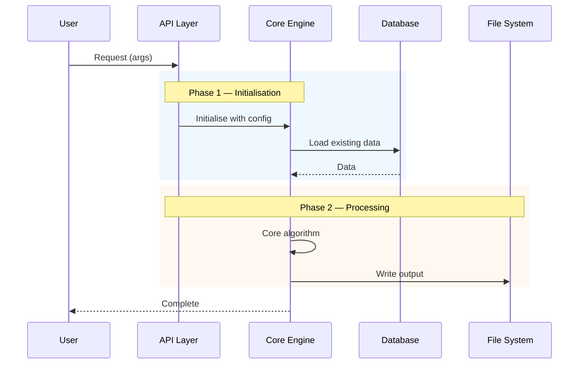

---

## 5. Class Diagram

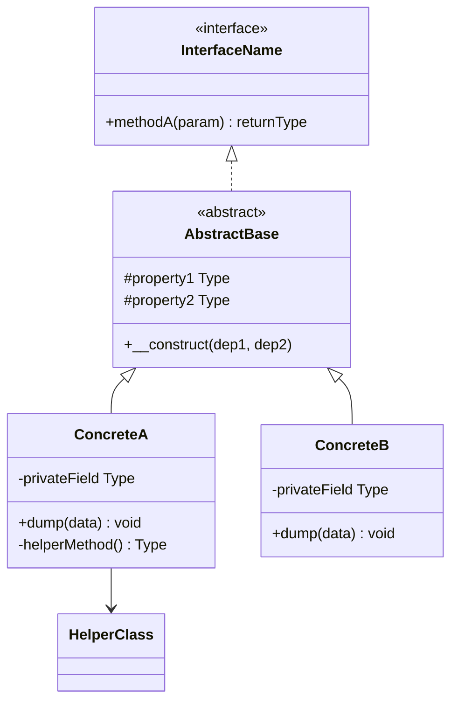

---

## 6. Entity Relationship Diagram

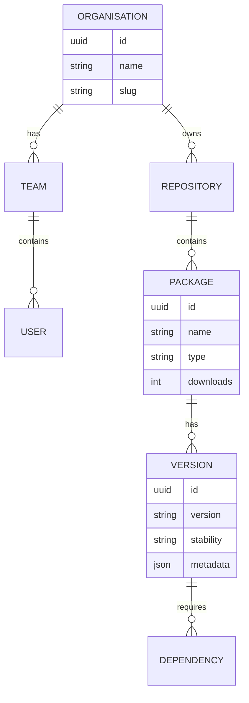

---

## 7. Mindmap (Hierarchical)

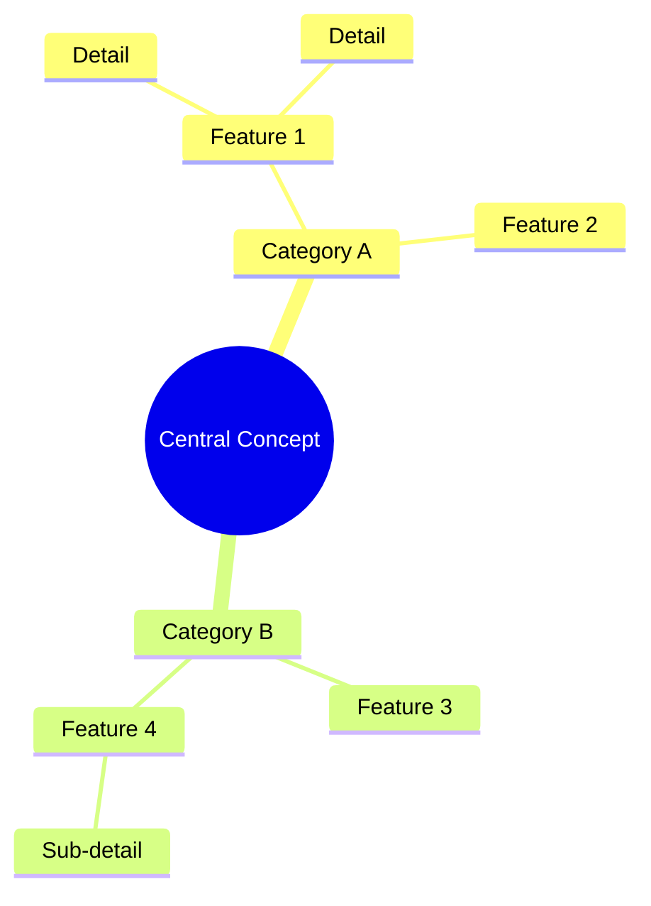

---

## 8. Gantt Chart (Roadmap)

```mermaid
gantt
    title Project Roadmap
    dateFormat YYYY-Q
    axisFormat %Y-Q%q

    section Phase 1 — MVP
    Feature A       :2026-Q2, 90d
    Feature B       :2026-Q2, 60d

    section Phase 2 — Growth
    Feature C       :2026-Q3, 45d
    Feature D       :2026-Q4, 30d
```

---

## 9. State Diagram

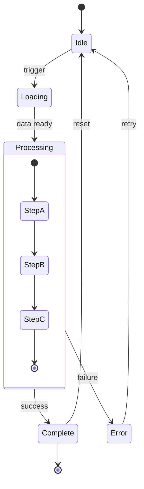

---

## 10. Quadrant Chart (Positioning)

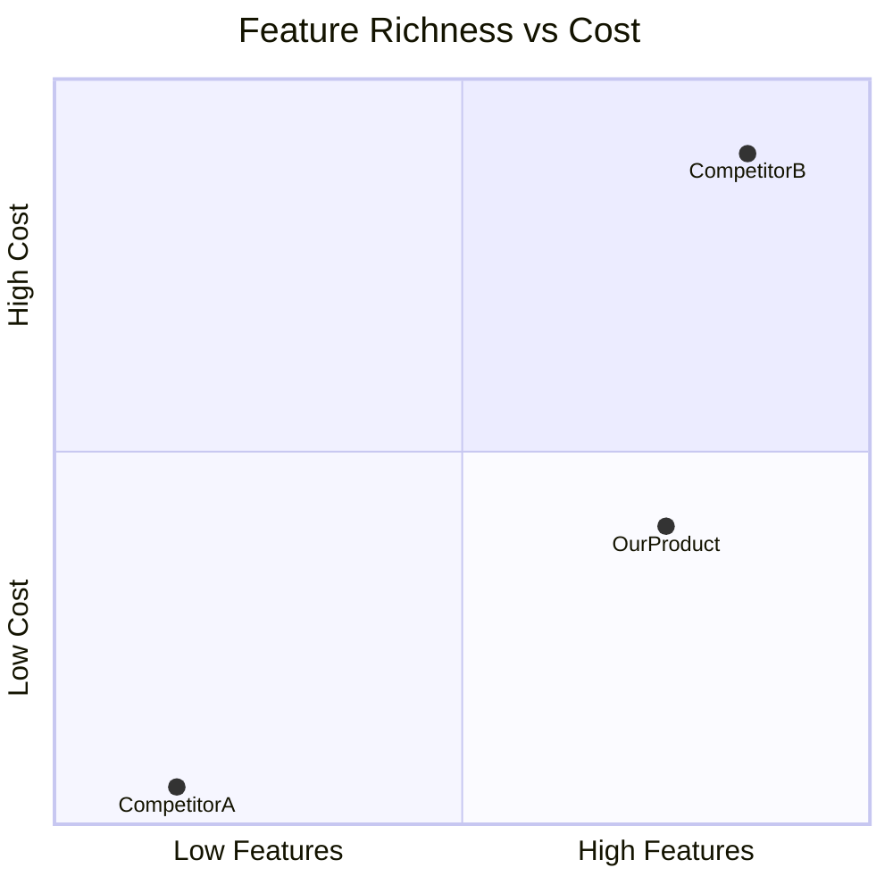

---

## 11. XY Chart (Revenue / Metrics)

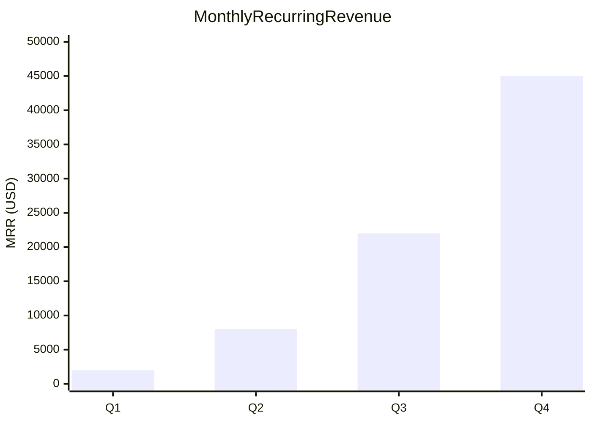

---

## 12. Styled Nodes

Use `style` to highlight important nodes:

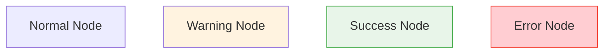

---

## 13. Subgraph Patterns

Group related items:

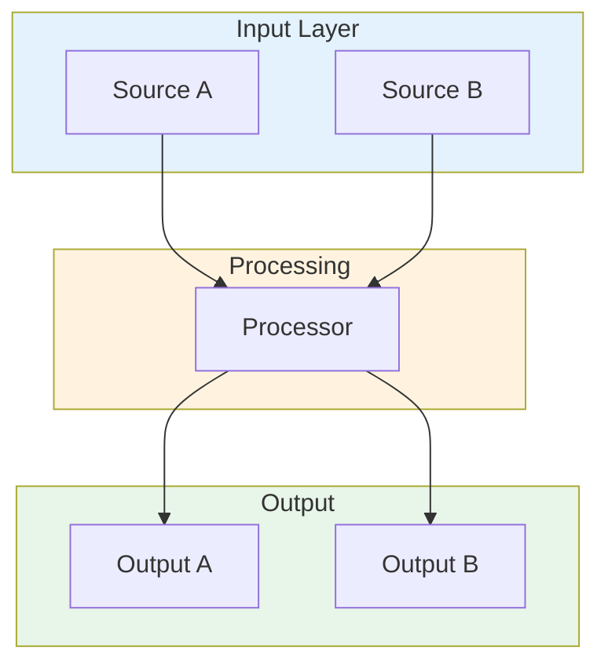

---

## 14. Pipeline Pattern (Horizontal)

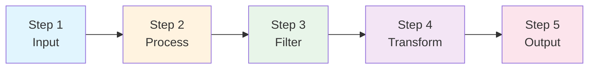

---

## Tips

- Keep node labels short (2-5 words) — add `<br/>` for second lines
- Use `rect rgb(r,g,b)` in sequence diagrams to group phases
- Prefer `flowchart` over `graph` — flowchart supports more features
- Use `TD` for process flows, `LR` for pipelines and comparisons
- Always close subgraphs with `end`
- Quote node labels containing special characters: `["Label (with parens)"]`
- Use `-->|label|` for edge labels in flowcharts
- Use `Note over A,B:` for wide notes in sequence diagrams
